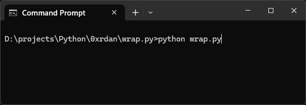
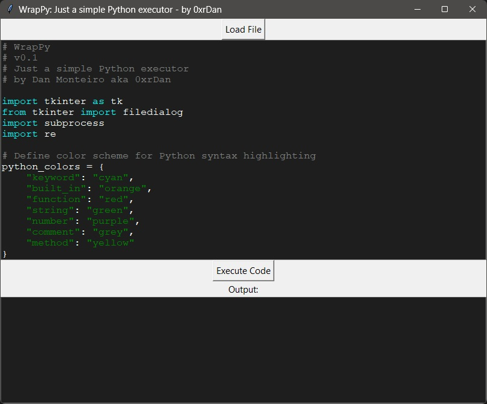

# WrapPy
| Build | Tests |
| :---: | :----: | 
|  | [](https://github.com/0xrdan/wrap.py/actions/workflows/github-code-scanning/codeql) [](https://github.com/0xrdan/wrap.py/actions/workflows/pylint.yml)| |

WrapPy is a simple Python script executor developed by [Dan Monteiro](https://github.com/0xrDan). It provides a user-friendly interface to load, execute, and display the output of Python scripts.

## Features
- Load Python scripts into the editor.
- Syntax highlighting for Python code.
- Execute loaded Python code and view output.
- Supports updating and executing code on-the-fly.

## Usage
1. **Load Script**: Click on the "Load File" button to select a Python script (*.py) from your filesystem. The script will be loaded into the text editor.
2. **Syntax Highlighting**: The script area automatically applies syntax highlighting to your code. You can also manually highlight syntax by modifying the code or clicking on any area of the script.
3. **Execute Code**: Once your script is loaded, click on the "Execute Code" button to run the Python code. The output will be displayed in the output area below.
4. **View Output**: The output of the executed code, including any print statements, will be shown in the output area.

## How to Run
1. Make sure you have Python 3.12+ installed on your system.
2. Clone or download this repository to your local machine.
3. Navigate to the directory containing the downloaded files.
4. Run the script by executing the following command:

```bash
python wrap.py
```

## Screenshots

*CMD/Terminal*


*WrapPy Interface*

## Notes
- Ensure your Python environment is correctly set up to execute the loaded scripts.
- Any errors encountered during script execution will be displayed in the output area.

## Contribution
Contributions and feedback are welcome! Feel free to open an issue or submit a pull request on [GitHub](https://github.com/0xrdan/wrap.py).

## License
This project is licensed under the [AGPL-3.0 License](LICENSE).
